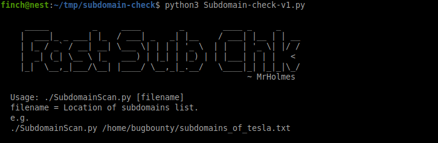

# subdomain-check
This is a python based tool to quickly check the response codes of subdomains, This needs a subdomain list to check through.

#### Instructions:
1. Git clone.
2. Make the .py file executable. (chmod +x).

##Usage
./Subdomain-check-v1.py [location of file with subdomains]

##### Thanks for trying it out. 
